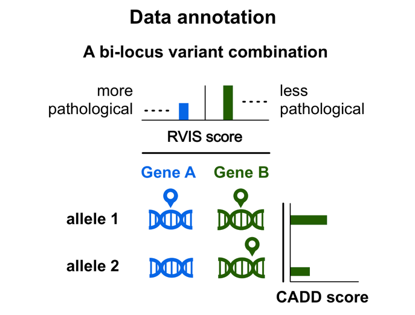

Data filtering and annotation
=============================

Data filtering
--------------

When passing no extra arguments to the `oligopipe` CLI, it will run with the default filtering procedure.

There are two types of filtering offered by `oligopipe`: a variant filtering and a gene filtering procedure.

### 1. Variant filtering
As command-line arguments:
```bash
Filtering options:
  -m MAX_MAF, --max-maf MAX_MAF
                        The MAF to filter variants (default: 0.035).
  --keep-intron-syn     Don't remove intronic and synonymous variants (not recommended).
  --keep-intergenic     Don't remove intergenic variants (not recommended).

```
In the config YAML:
```yaml
variant_filters:
  max_maf: 0.035
  remove_intronic_synonymous: True
  remove_intergenic: True
```

The variant filtering procedure ensures that your analysis will contain variants in accordance with the variant types 
used to train [VarCoPP](varcopp.md): 
exonic and splicing variants of MAF lower or equal than 3.5% in protein-coding genes.

##### **MAF**

Allows to change the minimum threshold of MAF for the variants. A MAF of ≤ 0.035 was used to train VarCoPP and is the recommended/default threshold.

##### **Keep Intergenic**
Add this flag if you want to disable the default setting of removing variants that are not inside the defined gene coordinates, based on the selected assembly (GRCh37/hg19 or GRCh38/hg38).
  
##### **Keep intronic and synonymous**
Add this flag if you want to disable the following defaults:

* removing all **intronic** variants that have a distance bigger than 13 nucleotides from each exon edge, based on the exon coordinates of the **canonical transcript** of the gene.
    
* removoing all **synonymous** variants that have a distance bigger than 195 nucleotides from each exon edge, based on the exon coordinates of the **canonical transcript** of the gene.


> **NOTE:** apart from the requested filtering steps, `oligopipe` may also exclude some extra variants during the 
> **data annotation process**. You can consult the complete list of variant exclusion cases during that
> process [here](#variant-exclusion).

### 2. Gene filtering
As command-line argument:
```bash
Filtering options:
  -gp gene_panel, --panel gene_panel
                        Gene panel file, containing a list of gene names or ENSGs to restrict the analysis.
```
In the config YAML:
```yaml
gene_panel_file:
```

The gene filtering option restricts the analysis to a **specified list of relevant genes** that can be present in your data. 
This procedure is **highly recommended** in case your VCF contains the complete exome of an individual, 
as it can dramatically limit the amount of False Positives that can be obtained.

To run your analysis only with a subset of genes, you can simply upload a .txt file with the gene names / ENSGs you are 
interested to include, each gene being in a different line. 
`oligopipe` will use this list to filter the genes that will be used in the analysis.


Data annotation
---------------

After you launch `oligopipe`, the program will:

1. automatically annotate your data with the biological information needed for the integrated methods, for which it needs to connect to an [annotation database](database.md); 
2. create all possible variant combinations between any pair of genes present in your variant input;
3. order the variants and genes inside each combination.

Below, you can find some important parameters for each process.

### 1. Gene annotation

To map variants in genes, `oligopipe` uses at first the gene information that is present in the [CADD](https://cadd.gs.washington.edu/) annotation file for that variant and uses only the **canonical transcripts** of those genes, according to the [Ensembl](https://www.ensembl.org/index.html) **GRCh37/hg19** or **GRCh38/hg38** genome version.

In cases where a variant can be mapped to **multiple genes**, `oligopipe` maps that variant to only **one gene** based on a set of priority rules that include (starting from higher to lower priority): valid gene IDs and canonical transcript, prioritisation of genes based on their biotype and the functional consequence of the variant, prioritisation of genes where the variant falls inside the gene and canonical transcript coordinates, presence of a CCDS, prioritisation of gene with the longest canonical transcript, etc.

`oligopipe` then annotates the genes with:

* the required gene features for [VarCoPP](varcopp.md#prediction-features) (detailed description of the features and their sources in the link)
* the [Residual Variation Intolerance Score (RVIS)](https://journals.plos.org/plosgenetics/article/info:doi/10.1371/journal.pgen.1003709), a metric that show the susceptibility of a gene to disease. Lower values of RVIS indicate greater susceptibility of a gene to candidate disease-causing mutations.

### 2. Gene pair annotation

`oligopipe` annotates a gene pair with the [gene pair features required by VarCoPP](varcopp.md#prediction-features).

`oligopipe` uses the [Residual Variation Intolerance Score (RVIS)](https://journals.plos.org/plosgenetics/article/info:doi/10.1371/journal.pgen.1003709)
metric to **order the appearance of genes** inside each digenic variant combination, with gene A being always the gene with the lower RVIS value,
and thus more probable to be have a disturbed function due to the presence of a variant. 
You can find more details about how `oligopipe` creates digenic variant combinations and orders variants and 
genes in the [Creating digenic variant combinations](preprocess.md#creating-digenic-variant-combinations) section.

### 3. Variant annotation

`oligopipe` first maps a variant in a gene based on the [Gene annotation](#1-gene-annotation) process described above. 
It then annotates each variant with the [required variant features for VarCoPP](varcopp.md#prediction-features), the most important being the [CADD score](https://www.ncbi.nlm.nih.gov/pubmed/?term=24487276%5Buid%5D).

When `oligopipe` creates digenic variant combinations, it uses the [CADD score](https://www.ncbi.nlm.nih.gov/pubmed/?term=24487276%5Buid%5D) 
to **order the appearance of variants** that are present inside the same gene (i.e. in cases of heterozygous compound variants). 
You can find more details about how `oligopipe` creates digenic variant combinations and orders variants and genes 
in the [Creating digenic variant combinations](#creating-digenic-variant-combinations) section.

##### Variant exclusion

In some situations during the data annotation process `oligopipe` excludes variants from the analysis and you will not find them in the results:

* **Variant not exonic in canonical transcript**  
    We use only the canonical Ensembl transcript identifiers to annotate our variants. If you have selected to exclude intronic variants from your analysis, if the variant is not exonic in the canonical transcript of the gene, even if it may be exonic in an alternative transcript, it will be excluded.
* **Variant with invalid zygosity**  
    Variants with GT: 0/0, 0|0, ./. or . in a VCF file are considered invalid and are excluded from the analysis.
* **CADD score not available**  
    `oligopipe` annotates variants with a [CADD score](https://www.ncbi.nlm.nih.gov/pubmed/?term=24487276%5Buid%5D), which is a feature required for the pathogenicity predictions. As this feature is important for the predictions, if a CADD score is not available for a variant, that variant is excluded for the analysis, as a missing value may severely alter the results.
* **Variants only in one gene**  
    As `oligopipe` creates combinations between **gene pairs**, if your input data includes variants from one gene only, you will not get any results.
* **The variant is a CNV or medium/long-sized InDel**  
    `oligopipe` analyses **only** SNVs and small insertions and deletions (up to 100 bp currently). Any other variant type in your data is automatically excluded from the analysis.

Creating digenic variant combinations
-------------------------------------

After annotation, VarCoPP creates all possible variant combinations between any gene pair present in your input, taking into consideration any filtering options you have included.

You can find below a list of details and constraints that take place during this procedure.

### 1. Number of variants per combination

`oligopipe` creates for any gene pair variant combinations that can be:

* bi-allelic (i.e. one mutated allele at each gene)  
    _e.g.:_ _one heterozygous variant per gene_
  
* tri-allelic (i.e. three mutated alleles in total)  
    _e.g.:_ _an homozygous variant at gene A and an heterozygous variant in gene B_  

* tetra-allelic (i.e. four mutated alleles in total)  
    _e.g.:_ _one homozygous variant per gene_  
    

In the tri-allelic and tetra-allelic cases, a digenic combination can also include **heterozygous compound variants** (i.e. two different mutated alleles in the same gene), along with the presence of variant(s) in another gene.

  

> **NOTE:** Tetra-allelic variant combinations with heterozygous compound variants in **BOTH** genes are **not** created.
 

> **NOTE:** In case where multiple heterozygous variants are present in a single gene, these are used together as heterozygous compound variants in a combination with another gene and not individually anymore. This is to solve the problem of certain genes being over-represented in the results just because they contain heterozygous compound variants.  
If a single gene contains more than two heterozygous variants, these are used in pairs of two as we always use two mutated alleles per gene.

  
### 2. Order of genes

For each digenic variant combination, **gene A** is always the gene with the **lowest** [Residual Variation Intolerance Score (RVIS)](https://journals.plos.org/plosgenetics/article/info:doi/10.1371/journal.pgen.1003709) 
(see also the [Gene Annotation](#1-gene-annotation) section) and, thus, the one with a higher probability to be associated with a disease.

### 3. Order of variant alleles inside the gene

In case of two different mutated alleles in the same gene (heterozygous compound cases), the **variant allele 1** is always the variant allele with the **highest CADD score**.

**A graphical representation of a digenic combination:**

